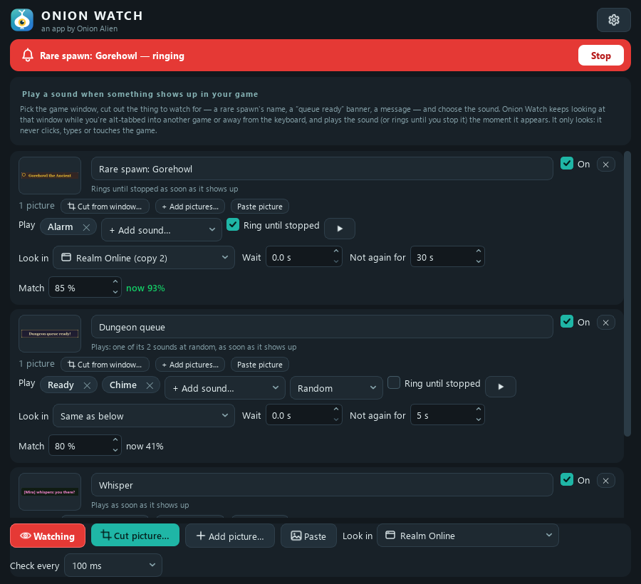
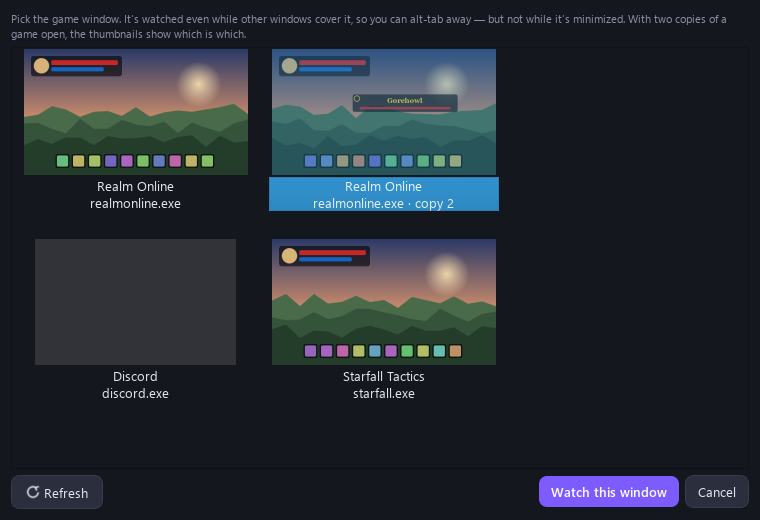
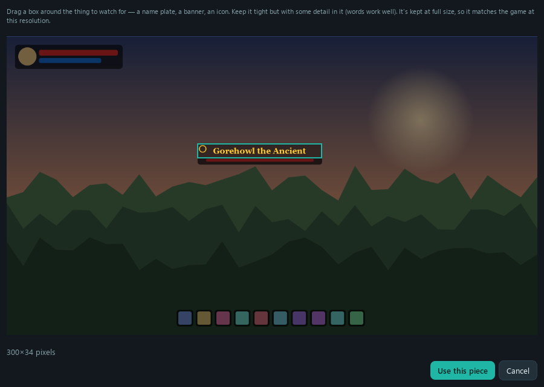
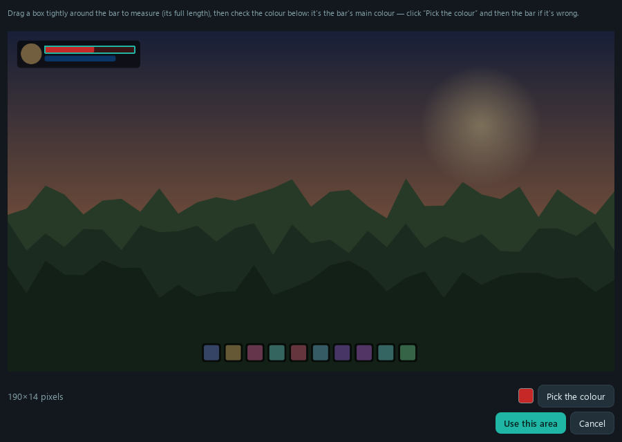

<p align="center"></p>

# Onion Watch

**Plays a sound when something shows up in a game — even while you're alt-tabbed
into a different one.**

Playing two MMO accounts at once, waiting on a rare spawn, a queue pop or a
whisper while you do something else? Pick the game's window, cut out the thing to
watch for, and choose a sound. Onion Watch keeps looking at that window while it's
behind your other windows and plays the sound, or rings until you're back, the
moment the thing appears.



**[⬇ Download Onion Watch for Windows](https://github.com/Onion-Alien/onion-watch/releases/latest/download/OnionWatchSetup.exe)**
(free, Windows 10 and 11, no account) · [website](https://onion-alien.github.io/onion-watch/) ·
[all versions](https://github.com/Onion-Alien/onion-watch/releases) ·
[VirusTotal scan of 0.5.5](https://www.virustotal.com/gui/file/8e0f3660956099434992989fc39e925924098cd15b77bf422f3076e36b3fc8b2):
68 of 68 engines clean

Windows or your browser may warn you about the download, because the installer isn't
code-signed. Click **More info → Run anyway**. It installs for your user only, without
admin rights.

<details>
<summary><b>More screenshots</b></summary>

Picking the windows to watch (two copies of the same game are told apart, or
watch every copy):


Cutting the picture to watch for straight out of the game window:


Pointing a trigger at a health bar:


</details>

## It only looks

Onion Watch reads pixels and plays sounds. It **never** presses keys, clicks,
moves the mouse, reads or changes a game's memory, or injects anything into a
game. It sees what you'd see on your screen, the same way OBS or Discord's screen
share does. That said, some games' terms forbid any third-party tool, so check
the rules of the game you play.

Everything happens on your PC. What it captures is never saved or sent anywhere
(only the pictures you cut are kept), and the app makes no network requests.

## What it does

- **Watches a window, not just a screen.** Windows are captured on their own, so
  a game is still watched while other windows cover it. It can't see a
  **minimized** window, because Windows stops drawing those.
- **Handles several accounts at once.** A trigger watches one window, several
  windows and screens, or **every copy of a game** (also copies started later), and
  the alert says which one it was. Two copies of the same game are told apart by
  the order they were started, so "copy 2" stays your second account's window.
- **More than "it shows up".** A trigger can go off when its picture **appears**,
  when it **goes away** (a buff running out, a fishing bobber), when anything
  **changes** in an area (a new chat line), when nothing has **moved for a while**
  (a stuck or disconnected game), or when a **bar runs low**: point it at a health
  bar, check its colour, and pick the level.
- **Only part of a window.** Drag the area to look in, so other things on screen
  can't set it off (it follows the window when it's resized).
- **Cut from window…** grabs the watched window (even from behind other
  windows) so you can drag a box around the thing to watch for. You can also add
  a picture file or paste one from Win+Shift+S.
- **Ring until you're back.** An alarm keeps playing until you are: until the
  game moves (it waits for the screen to settle first, so a fade-in doesn't count),
  until you switch to the game, until the thing is gone, until you touch the mouse
  or keyboard, or only until you click Stop. Stop, the tray icon and the Windows
  notification always stop it. Otherwise a sound plays once each time the thing
  appears.
- **What went off** (More → What went off…) lists the latest alerts, each with the
  window as it was checked and a box round what set it off: for "what woke me up?"
  and for setting the numbers. Kept only until the app closes.
- **Built-in alert sounds** (Chime, Ping, Ready, Bell, Alarm), or any sound file of
  yours. Sounds play on the speakers or headphones you pick in Settings.
- Per trigger:
  - several pictures (any of them counts) and several sounds (at random, in
    turn, or all at once);
  - a wait before playing, and a cooldown before it can play again;
  - how long it must last before it counts, so a flicker doesn't set it off;
  - how close a match must be, with the live match shown next to it;
  - staying quiet while the window it went off in is the one you're playing.
- **Duplicate** a trigger, and **save triggers to a file** (pictures and all) to
  move them to another PC or share them; sounds go by name.
- **Nothing is lost to a misclick.** Deleting a trigger asks first, and a deleted
  trigger stays in **Recently deleted** for 30 days, pictures and all, so it can be
  brought back.
- **Keeps watching from the tray** when you close the window.
- The same themes as [Onion Board](https://github.com/Onion-Alien/onion-board),
  plus its own teal **Hoot** theme. Onion Watch started as Onion Board's Triggers
  tab.

## How it works

Each check copies the watched window's inside with `PrintWindow`
(`PW_RENDERFULLCONTENT`). For a screen it uses Desktop Duplication, falling back
to GDI. The copy is shrunk to a few hundred pixels and turned grey. Each picture
is then found with normalised cross-correlation (an FFT), so a match scores the
same however bright the game is. Transparent parts of a picture are left out. A
place that matches in grey also has its colours compared with the picture's, so
a red potion isn't taken for a blue one.

With **Any size** (on by default) a picture is found even when the game shows it
bigger or smaller than when it was cut: cut in fullscreen and played in a window,
at another resolution, or with another UI scale. Each picture remembers the size
of the window it was cut from, so a resized game is matched at once; other sizes
are searched for a couple at a time and kept once found.

**Characters and creatures** work best cut out with a transparent background (a
PNG with the scenery erased): then only the model counts, so it's found over any
background, in daylight or at night, nearer or further away. A plain rectangle cut
around a model brings its scenery with it and is mostly found only where it was
cut. Picture matching can't follow a model that turns or changes pose, or is mostly
hidden: add a picture of each pose to the same trigger (it holds up to 100).

Watching keeps to about 1 % of your processor so games keep their frame rate. On
a slow computer, or with a lot of pictures, it looks less often than the "Check
every" setting rather than use more.

A trigger fires once each time its picture appears, then waits for it to go away
before it can fire again. A window that isn't open yet is looked for every two
seconds, and one that closes is picked up again when it reopens.

If a game's window comes out black (some exclusive-fullscreen games and some
anti-cheat do this), set the trigger to watch the **screen** the game is on
instead.

## Running from source

Windows 10 or 11, Python 3.12 or newer:

```bat
python -m venv .venv
.venv\Scripts\pip install -r requirements-dev.txt
.venv\Scripts\pythonw main.py
```

Checks: `.venv\Scripts\ruff check .` and `.venv\Scripts\python -m pytest`. The
tests run Qt offscreen with stand-in captures and a silent audio stream, so they
never read your screen or make a sound. `scripts\screenshots.py` renders the
screenshots above from made-up data, and `scripts\make_art.py` renders Hoot, the
avatar and the social preview into `docs\art\`.

Settings, the log, your pictures and your sound files live in
`%APPDATA%\OnionWatch`.

## Inside Onion Board

Onion Watch is also [Onion Board](https://github.com/Onion-Alien/onion-board)'s
Triggers tab, as an add-on. When you click **Get Onion Watch** on that tab, Onion
Board downloads `OnionWatch-module.zip` from this project's latest release,
checks it against the SHA-256 GitHub lists for it, and runs it right there: the
same triggers page, playing the board's sounds into your mic mix, in the board's
theme. Triggers made in the old built-in tab carry on as they were. It's one
codebase: the page talks to whichever program it runs in through a small host
interface (`onionwatch/host.py`).

To release a new version:

1. Bump `__version__` in `onionwatch/__init__.py`. If the host interface changed
   in a way an older Onion Board can't follow, also bump `API_VERSION` in
   `onionwatch/host.py` (Onion Board refuses a module whose version it doesn't
   know, with a message, instead of crashing).
2. `powershell -ExecutionPolicy Bypass -File build.ps1 -Clean -Scan` builds the app
   (`dist\OnionWatch\OnionWatch.exe`, self-tested), the installer
   (`dist\OnionWatchSetup.exe`, needs [Inno Setup 6](https://jrsoftware.org/isinfo.php))
   and the add-on (`dist\OnionWatch-module.zip`, via `scripts\build_module.py`, which
   fails if the page imports anything Onion Board doesn't ship: it has no pip).
   `-Scan` then checks the installer on VirusTotal (`scripts\vt_scan.py`, needs a free
   API key in `VT_API_KEY` or `~/.secrets/virustotal.env`).

   **Microsoft's `Trojan:Win32/Wacatac.B!ml`** (a machine-learning false positive on
   VirusTotal; Windows Defender itself finds nothing) is handled by two things in the
   build. Don't undo either:
   - the installer is **zip-compressed, not lzma** (`Compression=zip`,
     `SolidCompression=no` in `installer\OnionWatch.iss`). With solid lzma, 8 of 9
     test installers were flagged whatever was in them: 0.4.0, 0.3.1's source built
     again, even one with no `OnionWatch.exe` inside. So it was never the app's code
     or the bootloader, and 0.3.1's clean scan was luck. The same files zipped scanned
     clean every time. It costs about 30 MB;
   - every build uses a PyInstaller bootloader compiled on your PC
     (`scripts\build_bootloader.ps1`, needs gcc: `winget install
     BrechtSanders.WinLibs.POSIX.UCRT`), because PyPI's stock one is the same file in
     thousands of programs; `build.ps1` compiles one itself if the stock one is
     installed.

   If the scan flags the installer anyway, **don't release it**. Find what changed
   with one change at a time (an installer takes a minute to build with Inno Setup, a
   new file scans in a few), and scan several samples of a fix before trusting it:
   one clean scan can be luck.
3. `gh release create vX.Y.Z dist\OnionWatchSetup.exe dist\OnionWatch-module.zip --target main --title "Onion Watch X.Y.Z"`.
   Keep both file names: the website links to the setup, Onion Board looks for the zip.

To try a zip in Onion Board before releasing it, start Onion Board with
`ONIONBOARD_ONION_WATCH_ZIP` set to the zip's path: its *Get Onion Watch* button
then installs that file instead of downloading.

## Code layout

| Path | What |
|---|---|
| `onionwatch/screenwatch.py` | the engine: screen capture (DXGI Desktop Duplication, GDI fallback, grey and when needed colour), the matcher, the kinds of trigger (appears, goes away, area changes / stops changing, colour level) and their areas, the fire-once `Gate`, the watcher thread (one capture per screen or window in use, every copy of a game expanded), `Trigger`, `WindowRef` and `Hit` |
| `onionwatch/windows.py` | listing windows, finding a remembered one again (and the right copy), `PrintWindow` capture of a covered window, full-size snapshots for cutting |
| `onionwatch/sounds.py` | the built-in alert sounds (made in code) and the added sound files |
| `onionwatch/player.py` | the output stream that mixes and rings the alerts |
| `onionwatch/settings.py` | `%APPDATA%\OnionWatch` and `config.json` |
| `onionwatch/app.py` | start-up: logging, one copy at a time, the window, `--selftest` |
| `onionwatch/host.py` | what the triggers page needs from the program it runs in (settings, sounds, playing, theme): the Onion Watch app or Onion Board |
| `onionwatch/apphost.py` | the Onion Watch app as that host |
| `onionwatch/board.py` | the Onion Board add-on's entry point: `create(host)` gives the board its Triggers tab (alarm bar + triggers page) |
| `onionwatch/ui/triggerspanel.py` | the triggers page: one card per trigger, "Look in", Watching, Cut picture. Talks only to its host |
| `onionwatch/ui/alarmbar.py` | the red bar shown while a trigger rings, with Stop |
| `onionwatch/ui/windowpicker.py` | the window list with live thumbnails; ticking several windows and screens, or every copy of a game |
| `onionwatch/ui/snip.py` | cutting a picture out of a capture; picking a trigger's area and a bar's colour |
| `onionwatch/ui/history.py` | "What went off": the latest alerts with a picture of each moment (in memory only) |
| `onionwatch/ui/deleted.py` | Recently deleted triggers (kept 30 days with their pictures, in the saved settings) |
| `onionwatch/packs.py` | saving triggers to a .zip with their pictures and loading them back |
| `onionwatch/ui/mainwindow.py` | the window, the tray icon, notifications |
| `onionwatch/ui/settingsdialog.py` | output device, volume, notifications, tray, theme |
| `onionwatch/owl.py` | Hoot, the mascot owl, drawn in code (Onion Board's Bun's style), and `OwlWidget`: Hoot animated, waiting for a trigger |
| `onionwatch/theme.py`, `ui/icons.py`, `ui/panel.py` | themes, the logo, painted icons and layout helpers, shared with Onion Board |
| `onionwatch/singleinstance.py` | one copy at a time: a second launch brings the running one to the front |
| `onionwatch/shuffle.py`, `wheelguard.py` | picking sounds "at random" without repeats; the mouse wheel scrolls the page instead of changing a box |
| `scripts/screenshots.py`, `scripts/make_art.py` | the README screenshots and `docs/art`, rendered offscreen from made-up data |
| `build.ps1`, `installer/OnionWatch.iss` | the Windows build (PyInstaller) and its installer (Inno Setup) |
| `scripts/prune_build.py`, `make_notices.py`, `make_installer_art.py`, `make_version_info.py` | the build's helpers: drop the Qt parts the app never loads, the third-party licence notices, the icon and the setup wizard's pictures, the exe's version details |
| `scripts/build_bootloader.ps1`, `scripts/vt_scan.py` | PyInstaller with a bootloader compiled on your PC (virus scanners distrust the stock one); the VirusTotal check for a release |
| `docs/index.html` | the website, [onion-alien.github.io/onion-watch](https://onion-alien.github.io/onion-watch/) (GitHub Pages, from `docs/`) |
| `scripts/check_sensitive.py` | scans files, commits and history for secrets and personal data; the pre-commit hook |
| `scripts/live_check.py` | the real thing on this PC: two copies of a stand-in game (real windows, one covered), real `PrintWindow` capture, the triggers page as Onion Board loads it, one trigger for every copy in an area, one for a picture going away; prints PASS. Opens windows for a few seconds (never takes the focus) |
| `scripts/build_module.py` | builds `OnionWatch-module.zip` for Onion Board: `module.json` and only the modules the board's tab needs, checked against what Onion Board ships |
| `tests/` | pytest: the matcher, the watcher on stand-in screens and windows (several copies of a game, every copy, not open yet, closed and reopened, minimized, resized), each kind of trigger and its area, the sounds and player, the UI offscreen |

## Licence

MIT with the Commons Clause, like Onion Board: free to use, change and share, but
not to sell. See [LICENSE](LICENSE).
